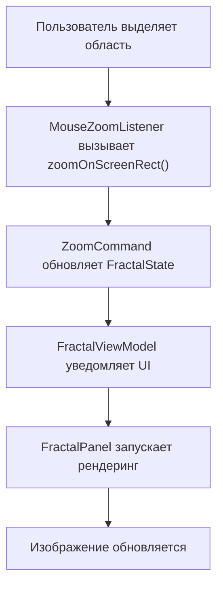
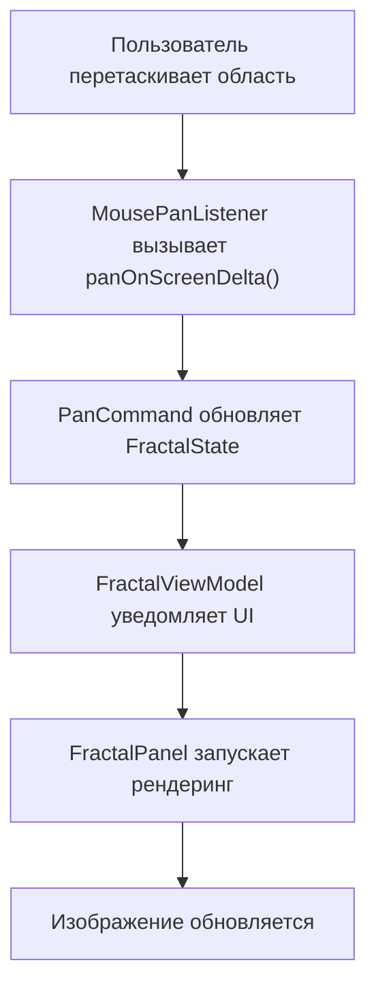
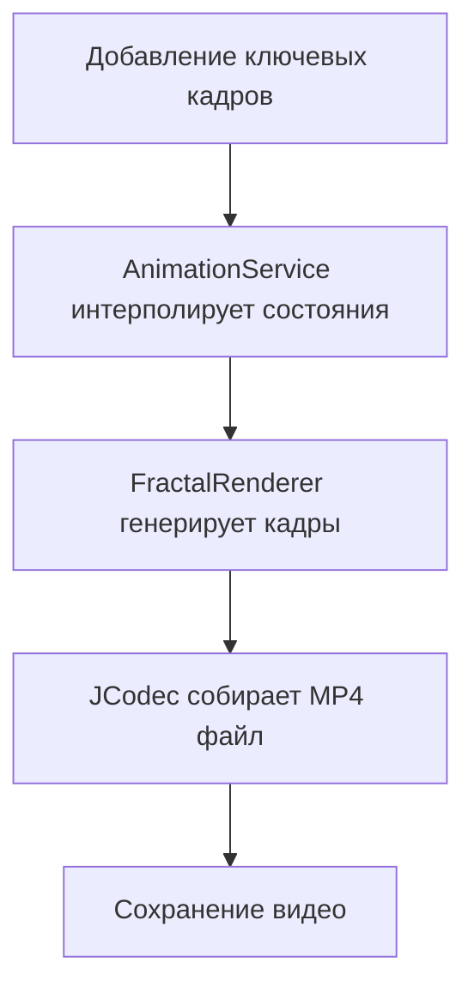
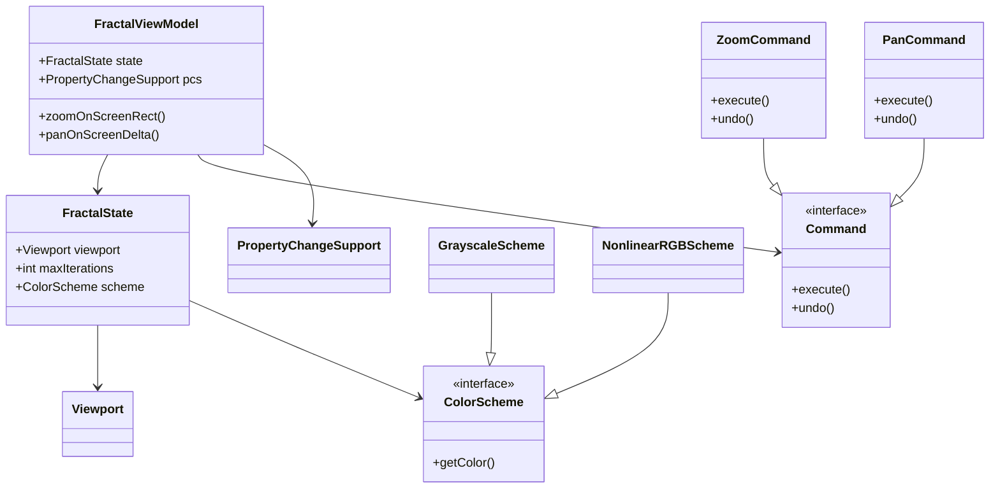
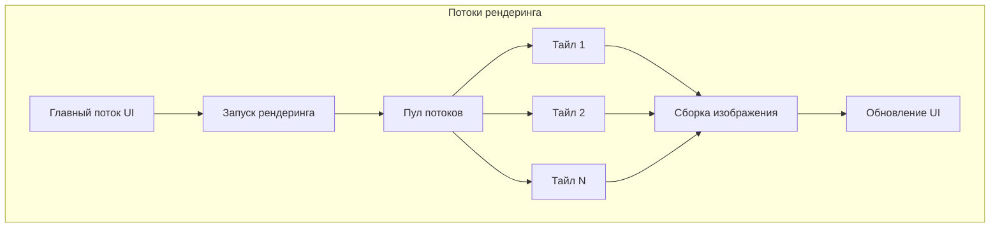
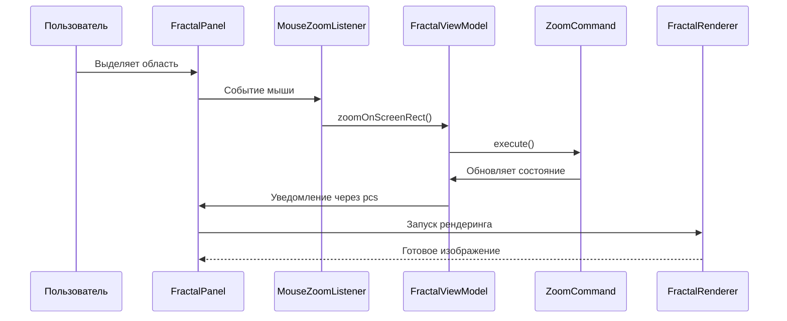
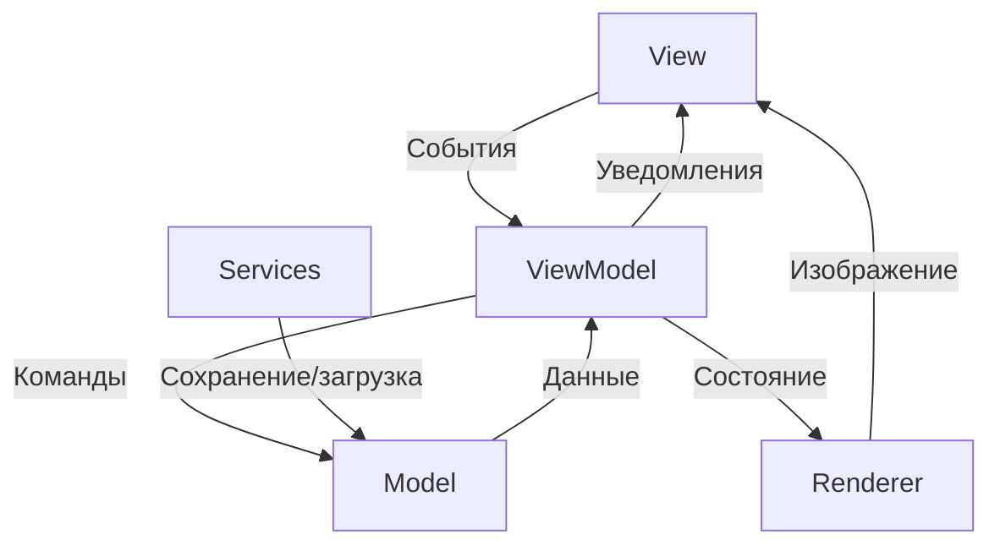
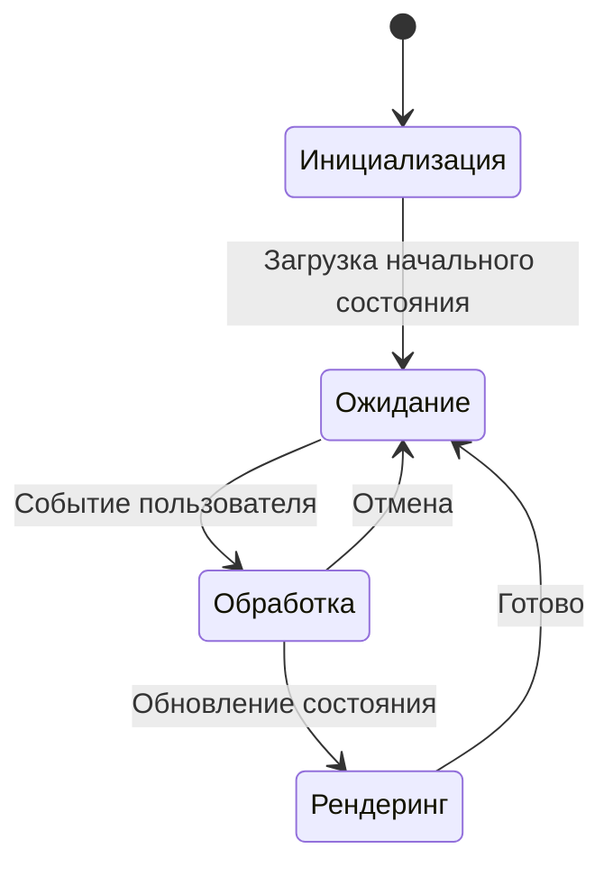

# Fractal Explorer

## Математические основы

### Множество Мандельброта
Множество Мандельброта - это множество точек `c` на комплексной плоскости, для которых последовательность:
```
z_{n+1} = z_n^2 + c
```
при начальном условии `z_0 = 0` остается ограниченной (не стремится к бесконечности).

Критерий принадлежности:
- Если на некоторой итерации `n` выполняется `|z_n|^2 > 4`, точка `c` не принадлежит множеству
- Максимальное число итераций `maxIterations` определяет детализацию изображения

### Множество Жюлиа
Для фиксированного комплексного параметра `c`, множество Жюлиа `J(c)` состоит из точек `z_0`, для которых последовательность:
```
z_{n+1} = z_n^2 + c
```
остается ограниченной.

Ключевые отличия от Мандельброта:
- Параметр `c` фиксирован для всего множества
- Начальная точка `z_0` меняется (в отличие от Мандельброта, где `z_0=0`)

### Связь между множествами
- Каждая точка `c` множества Мандельброта соответствует связному множеству Жюлиа `J(c)`
- Точки на границе Мандельброта дают наиболее сложные и интересные множества Жюлиа
- В приложении: двойной клик на точке Мандельброта открывает соответствующее множество Жюлиа

### Визуализация и цветовые схемы
Цвет точек определяется количеством итераций до расхождения:
- Черный: точка принадлежит множеству (не расходится за `maxIterations` итераций)
- Цветные: точка вне множества, цвет показывает скорость расхождения
- Разные цветовые схемы (Grayscale, NonlinearRGB) позволяют выделять различные особенности фракталов

## Описание проекта
Приложение для визуализации и исследования фракталов (Мандельброта и Жюлиа) с поддержкой интерактивного масштабирования, сохранения состояний, экспорта изображений и генерации анимаций.

---

## Архитектура

### 3.2. Структура компонентов
#### 3.2.1. View (пакет `view`)
- **MainFrame**: Основное окно приложения, содержит `FractalPanel` и `StatusBar`. Использует MVC.
- **FractalPanel**: Кастомный компонент для отображения фрактала, наследуется от `JPanel`. 
- **StatusBar**: Панель внизу окна, отображает статус и прогресс рендеринга.
- **JuliaSetWindow**: Окно для множества Жюлиа с собственными `FractalViewModel`, `FractalRenderer` и `FractalPanel`.
- **AnimationSetupDialog**: Диалог для настройки анимации, включает:
  - **KeyframeListPanel**: Список ключевых кадров.
  - **KeyframePreviewPanel**: Предпросмотр кадра с собственным `FractalPanel`.
  - **GenerationControlPanel**: Управление генерацией анимации через `SwingWorker`.

#### 3.2.2. Listeners (пакет `listeners`)
- **MouseZoomListener**: Обработка зума (ЛКМ) через `FractalViewModel.zoomOnScreenRect()`.
- **MousePanListener**: Панорамирование (ПКМ) через `FractalViewModel.panOnScreenDelta()`.

#### 3.2.3. ViewModel (пакеты `viewmodel`, `viewmodel.commands`)
- **FractalViewModel**: 
  - Хранит `FractalState`.
  - Предоставляет методы для UI (изменение масштаба, цветовой схемы, итераций).
  - Использует **Command Pattern** (команды `ZoomCommand`, `PanCommand`) для Undo/Redo через `UndoManager`.
  - Уведомляет UI через `PropertyChangeSupport`.

#### 3.2.4. Render (пакет `render`)
- **FractalRenderer**: 
  - Асинхронный рендеринг через `ExecutorService` и тайлы.
  - Обработка прогресса и отмены задач.
- **TileCalculator**: Разбиение области на тайлы.

#### 3.2.5. Services (пакет `services`)
- **FileService**: 
  - Сериализация/десериализация `FractalState` (формат `.frac`).
  - Экспорт изображений с подписью параметров.
- **AnimationService**: 
  - Генерация анимаций через JCodec.
  - Интерполяция состояний между ключевыми кадрами.
  
### 3.3. Взаимодействие компонентов
1. **Пример сценария зума**:
   - Пользователь выделяет область на `FractalPanel` → 
   - `MouseZoomListener` вызывает `viewModel.zoomOnScreenRect()` → 
   - `ZoomCommand` выполняется, обновляет `FractalState` → 
   - `FractalViewModel` уведомляет UI через `PropertyChange` → 
   - `FractalPanel` запускает рендеринг через `FractalRenderer` → 
   - Изображение обновляется в потоке EDT.



2. **Пример панорамирования**:
   - Пользователь перетаскивает область с помощью ПКМ → 
   - `MousePanListener` вызывает `viewModel.panOnScreenDelta()` → 
   - `PanCommand` выполняется, обновляет `FractalState` → 
   - `FractalViewModel` уведомляет UI через `PropertyChange` → 
   - `FractalPanel` запускает рендеринг через `FractalRenderer` → 
   - Изображение обновляется в потоке EDT.



3. **Генерация анимации**:
   - Пользователь добавляет ключевые кадры в диалоге → 
   - `AnimationService` интерполирует состояния между кадрами → 
   - `FractalRenderer` генерирует кадры для каждого состояния → 
   - Сборка MP4 происходит через JCodec → 
   - Результат сохраняется в указанном пути.



### 3.4. Паттерны проектирования и архитектура

#### Диаграмма классов основных компонентов


#### Потоковая модель рендеринга


#### Последовательность операций при зуме


#### Архитектура приложения


#### Жизненный цикл состояния


### 3.5. Детали реализации
1. **Многопоточность**: 
   - Рендеринг выполняется в пуле потоков (ExecutorService)
   - Каждый тайл обрабатывается независимо
   - Синхронизация через SwingUtilities.invokeLater()

2. **Сериализация**:
   - Состояние сохраняется в бинарном формате
   - Используется стандартная Java сериализация
   - Версионность через serialVersionUID

3. **Оптимизации**:
   - Кэширование вычисленных значений
   - Предварительный расчет цветовой палитры
   - Оптимальный размер тайлов (64x64 пикселя)
---

## Запуск и использование

### 4.1. Требования
- **JDK 11+** (для многопоточности и JCodec).
- **Библиотека JCodec**: Добавьте в classpath (через Maven/Gradle или вручную).

### 4.2. Сборка и запуск
#### Из IDE (IntelliJ/Eclipse):
1. Импортируйте проект.
2. Добавьте JAR-файл JCodec в зависимости.
3. Запустите `view.MainFrame` как главный класс.

#### Из командной строки:
```bash
# Если собран как Runnable JAR:
java -jar FractalExplorer.jar

# Если JCodec не включен в JAR:
java -cp "FractalExplorer.jar:jcodec-javase-0.2.5.jar" view.MainFrame
```

### 4.3. Основные функции
#### Навигация
- **Зум**: ЛКМ + выделение области.
- **Панорамирование**: ПКМ + перетаскивание.

#### Множество Жюлиа
- Двойной клик ЛКМ на точке множества Мандельброта → открытие окна Жюлиа.

#### Настройки
- **Макс. итераций**: Меню "Вид" → "Задать макс. итераций".
- **Цветовая схема**: Меню "Вид" → "Цветовая схема".

#### Сохранение/загрузка
- **Состояние**: Меню "Файл" → "Сохранить/Загрузить состояние".
- **Изображение**: Меню "Файл" → "Сохранить как" → форматы `.png/.jpg`.

#### Анимация
1. Откройте редактор анимации (меню "Анимация").
2. Добавьте ключевые кадры, настройте параметры.
3. Нажмите "Генерировать видео" → выберите путь и формат MP4.

---

## Возможные улучшения
- Добавить поддержку GPU-ускорения (JOCL).
- Расширить набор цветовых схем с редактором градиентов.
- Реализовать Redo для `UndoManager`.
- Добавить поддержку других фракталов (Burning Ship, Newton).
- Оптимизация рендеринга через проверку кардиоиды Мандельброта.
- Интеграция с системой сборки (Maven/Gradle).

---

## Лицензия
MIT License. Используйте, изменяйте и распространяйте на условиях лицензии.
