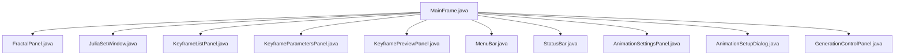
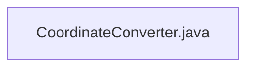
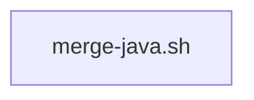

# Mandelbrot Project

## Описание проекта

Проект Mandelbrot представляет собой приложение для визуализации фракталов, таких как множество Мандельброта и множество Жюлиа. Приложение позволяет пользователю создавать анимации, настраивать параметры фракталов и сохранять результаты.

## Архитектура приложения

Проект состоит из нескольких модулей, каждый из которых отвечает за определенную часть функциональности приложения. Ниже приведена детальная архитектура с графиками.

### Модуль app

Модуль `app` отвечает за графический интерфейс пользователя (GUI) и управление пользовательским вводом. Он включает следующие компоненты:

- **MainFrame.java**: Основное окно приложения, содержащее все панели и меню.
- **FractalPanel.java**: Панель для отображения фракталов.
- **JuliaSetWindow.java**: Окно для настройки множества Жюлиа.
- **KeyframeListPanel.java**: Панель для управления ключевыми кадрами.
- **KeyframeParametersPanel.java**: Панель для настройки параметров ключевых кадров.
- **KeyframePreviewPanel.java**: Панель для предварительного просмотра ключевых кадров.
- **MenuBar.java**: Меню приложения, содержащее основные команды.
- **StatusBar.java**: Статусная строка приложения, отображающая текущее состояние.
- **AnimationSettingsPanel.java**: Панель для настройки анимации.
- **AnimationSetupDialog.java**: Диалог для настройки анимации.
- **GenerationControlPanel.java**: Панель для управления генерацией фракталов.

### Модуль core

Модуль `core` содержит основные математические функции и модели, необходимые для вычисления и рендеринга фракталов. Он включает следующие компоненты:

- **FractalFunction.java**: Базовый класс для математических функций фракталов.
- **JuliaFunction.java**: Класс для вычисления множества Жюлиа.
- **MandelbrotFunction.java**: Класс для вычисления множества Мандельброта.
- **ColorScheme.java**: Базовый класс для схем окрашивания.
- **FractalState.java**: Класс для хранения состояния фрактала.
- **GrayscaleScheme.java**: Схема окрашивания в оттенках серого.
- **NonlinearRGBScheme.java**: Схема окрашивания с нелинейной RGB-шкалой.
- **Viewport.java**: Класс для управления областью просмотра.
- **FractalRenderer.java**: Класс для рендеринга фракталов.
- **Tile.java**: Класс для представления тайлов.
- **TileCalculator.java**: Класс для вычисления тайлов.
- **AnimationService.java**: Сервис для управления анимацией.
- **FileService.java**: Сервис для работы с файлами.
- **ComplexNumber.java**: Класс для работы с комплексными числами.
- **CoordinateConverter.java**: Класс для конвертации координат.
- **FractalViewModel.java**: Модель представления фракталов.
- **Command.java**: Базовый класс для команд.
- **PanCommand.java**: Команда для панорамирования.
- **UndoManager.java**: Менеджер отмены команд.
- **ZoomCommand.java**: Команда для масштабирования.

### Модуль coordinate-converter

Модуль `coordinate-converter` отвечает за конвертацию координат между различными системами координат. Он включает следующие компоненты:

- **CoordinateConverter.java**: Класс для конвертации координат.

### Модуль merge-java.sh

Модуль `merge-java.sh` представляет собой скрипт для объединения Java-файлов. Он используется для автоматизации процесса объединения исходных файлов в один.

### Графики архитектуры

#### График модуля app



#### График модуля core

```mermaid
graph TD
  A[FractalFunction.java] --> B[JuliaFunction.java]
  A --> C[MandelbrotFunction.java]
  A --> D[ColorScheme.java]
  A --> E[FractalState.java]
  A --> F[GrayscaleScheme.java]
  A --> G[NonlinearRGBScheme.java]
  A --> H[Viewport.java]
  A --> I[FractalRenderer.java]
  A --> J[Tile.java]
  A --> K[TileCalculator.java]
  A --> L[AnimationService.java]
  A --> M[FileService.java]
  A --> N[ComplexNumber.java]
  A --> O[CoordinateConverter.java]
  A --> P[FractalViewModel.java]
  A --> Q[Command.java]
  A --> R[PanCommand.java]
  A --> S[UndoManager.java]
  A --> T[ZoomCommand.java]
```



#### График модуля coordinate-converter



#### График модуля merge-java.sh



## Математическая теория

### Множество Мандельброта

Множество Мандельброта определяется следующим образом:
\[ z_{n+1} = z_n^2 + c \]
где \( z \) и \( c \) — комплексные числа, а \( z_0 = 0 \). Если последовательность \( z_n \) остается ограниченной, то \( c \) принадлежит множеству Мандельброта.

### Множество Жюлиа

Множество Жюлиа определяется следующим образом:
\[ z_{n+1} = z_n^2 + c \]
где \( z \) и \( c \) — комплексные числа, а \( z_0 \) — начальное значение. Если последовательность \( z_n \) остается ограниченной, то \( z_0 \) принадлежит множеству Жюлиа.

### Применение формул в коде

Формулы для вычисления множеств Мандельброта и Жюлиа применяются в классах `MandelbrotFunction.java` и `JuliaFunction.java` соответственно. Пример использования формулы в коде:

#### Пример использования формулы в `MandelbrotFunction.java`

```java
public class MandelbrotFunction implements FractalFunction {
    @Override
    public ComplexNumber iterate(ComplexNumber z, ComplexNumber c) {
        return z.multiply(z).add(c);
    }
}
```

#### Пример использования формулы в `JuliaFunction.java`

```java
public class JuliaFunction implements FractalFunction {
    private final ComplexNumber c;

    public JuliaFunction(ComplexNumber c) {
        this.c = c;
    }

    @Override
    public ComplexNumber iterate(ComplexNumber z, ComplexNumber c) {
        return z.multiply(z).add(this.c);
    }
}
```

## Инструкции по установке и использованию

### Установка

1. Клонируйте репозиторий:
   ```sh
   git clone https://github.com/NIKIRIKI7/Mandelbrot.git
   ```

2. Перейдите в директорию проекта:
   ```sh
   cd mandelbrot
   ```

3. Соберите проект с помощью Maven:
   ```sh
   mvn clean install
   ```

### Использование

1. Запустите приложение:
   ```sh
   java -jar app/target/app-1.0-SNAPSHOT.jar
   ```

2. В главном окне приложения выберите фрактал, который хотите визуализировать (Мандельброт или Жюлиа).

3. Настройте параметры фрактала и анимации с помощью панелей управления.

4. Нажмите кнопку "Generate" для генерации фрактала.

5. Сохраните результаты в файл с помощью меню "File".

## Математическая теория

### Множество Мандельброта

Множество Мандельброта определяется следующим образом:
\[ z_{n+1} = z_n^2 + c \]
где \( z \) и \( c \) — комплексные числа, а \( z_0 = 0 \). Если последовательность \( z_n \) остается ограниченной, то \( c \) принадлежит множеству Мандельброта.

### Множество Жюлиа

Множество Жюлиа определяется следующим образом:
\[ z_{n+1} = z_n^2 + c \]
где \( z \) и \( c \) — комплексные числа, а \( z_0 \) — начальное значение. Если последовательность \( z_n \) остается ограниченной, то \( z_0 \) принадлежит множеству Жюлиа.

## Инструкции по установке и использованию

### Установка

1. Клонируйте репозиторий:
   ```sh
   git clone https://github.com/NIKIRIKI7/Mandelbrot.git
   ```

2. Перейдите в директорию проекта:
   ```sh
   cd mandelbrot
   ```

3. Соберите проект с помощью Maven:
   ```sh
   mvn clean install
   ```

### Использование

1. Запустите приложение:
   ```sh
   java -jar app/target/app-1.0-SNAPSHOT.jar
   ```

2. В главном окне приложения выберите фрактал, который хотите визуализировать (Мандельброт или Жюлиа).

3. Настройте параметры фрактала и анимации с помощью панелей управления.

4. Нажмите кнопку "Generate" для генерации фрактала.

5. Сохраните результаты в файл с помощью меню "File".
